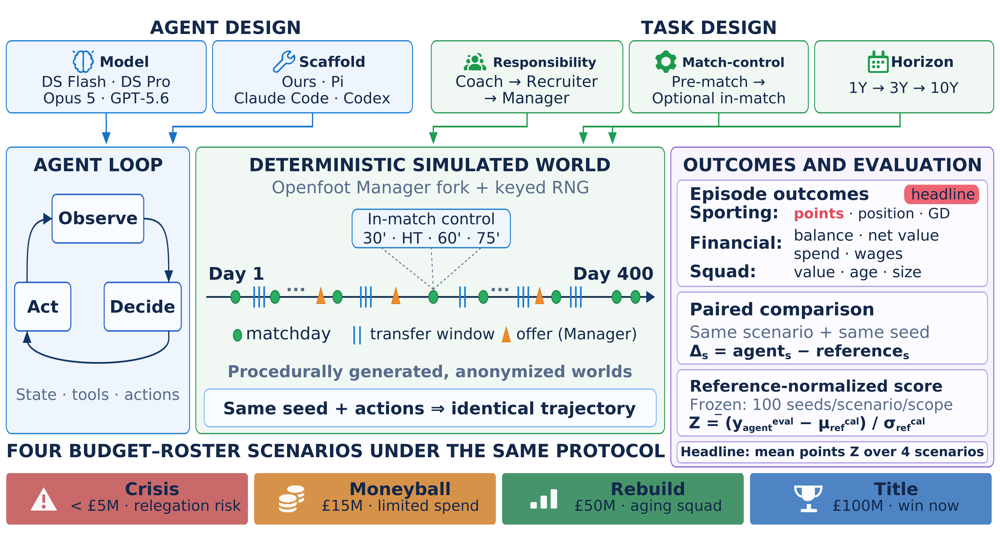

# FromPitch2Board

**A deterministic benchmark for long-horizon management agents.**

FromPitch2Board evaluates autonomous agents — not isolated language models — inside a
headless football-club-management simulation. It asks where an agent's
capability comes from: the foundation model, the surrounding scaffold, the scope
of responsibility, the granularity of control, or the decision horizon.



## Five configurable factors, one simulator

| Axis | Levels |
|---|---|
| Foundation model | four served models |
| Agent scaffold | Ours (stateless observe–act), Pi, Claude Code, Codex |
| Responsibility scope | Coach → Recruiter → Manager |
| Match-control granularity | pre-match only, or in-match stops at 30′, HT, 60′, 75′ |
| Horizon | one, three, or ten consecutive seasons |

Four budget-and-roster scenarios — *crisis*, *moneyball*, *rebuild*, *title* —
instantiate the management spectrum. Coach selects the eleven and sets tactics
with transfers frozen; Recruiter adds scouting and buying; Manager adds selling,
offer negotiation, and responsibility for the wage and transfer budgets. Every
factor is varied on the same world, opponent, and scoring rule, so differences
can be attributed to the axis under test rather than to a change of environment.

## Reference results

Scores are league points normalised against a frozen reference calibration,
averaged over four scenarios with eight paired seeds each. The **Composition
Gap** is `Coach Z − Manager Z`: positive means the agent's reference-normalised
advantage falls once management responsibilities are added.

| Track | Scaffold | Model | Coach Z | Manager Z | Composition Gap |
|---|---|---|---|---|---|
| Model | Ours | DS Flash | +0.51 | +0.67 | −0.16 |
| Model | Ours | DS Pro | +0.59 | +0.76 | −0.17 |
| Model | Ours | Opus 5 | +0.55 | +0.61 | −0.06 |
| Model | Ours | GPT-5.6 | **+0.70** | **+0.08** | **+0.62** |
| — | Rule policy | Greedy reference | +0.08 | −0.09 | +0.17 |
| Agent | Pi | DS Flash | +0.55 | +1.08 | −0.53 |
| Agent | Pi | DS Pro | +0.55 | **+1.17** | −0.62 |
| Agent | Claude Code | DS Flash | +0.54 | +1.02 | −0.48 |
| Agent | Claude Code | DS Pro | +0.46 | +0.95 | −0.49 |
| Agent | Codex | DS Flash | +1.05 | +1.15 | −0.10 |
| Agent | Codex | DS Pro | **+1.39** | +1.14 | +0.25 |

What the benchmark separates:

- **Responsibility expansion, not single-role quality, is what discriminates.**
  Under the stateless scaffold the four models span only 0.19 Z on Coach, but
  0.68 Z on Manager.
- **The failure localises to one boundary.** GPT-5.6's raw season points run
  46.1 → 58.1 → 46.8 across the responsibility ladder, so recruitment *raises*
  its score and full management removes the gain. The paired
  Recruiter-to-Manager contrast is −11.28 ± 2.28 points.
- **The regression has a behavioural signature.** Across that boundary its
  skipped-decision rate rises from 1.1% to 57.9%, and on the 1,216 matchday
  decision points both scopes share it rises from 0.2% to 58.0% — so it is not
  confined to the newly added events, and no invalid actions are involved.
- **Scaffold choice can matter more than a nearby model swap.** Within the fully
  crossed Flash–Pro pair, scaffold choice moves Manager Z by up to 0.48, while
  Pro-minus-Flash estimates stay within ±0.09.
- **One season does not predict the next.** The three-year cohort reverses its
  mean ranking between years one and three, and a selected ten-season
  configuration peaks in year three and stays below that peak.

## Why football management

Professional football management is a natural testbed for long-horizon agent
research because it is long-horizon (hundreds of decisions per season),
partially observable (hidden ability, noisy scouting), multi-objective
(sporting results, finances, squad building, board goals), and objectively
scored — league points, wage bill and squad value are simulator facts, with no
LLM-as-judge. The environment does not claim to reproduce professional football
faithfully; it instantiates the computational structure of long-horizon
management under uncertainty.

## Determinism

The simulator threads keyed random streams through world generation, the match
engine and every turn subsystem. Randomness is partitioned into semantic
sub-streams (days, matches, scouting), so consuming randomness in one domain
does not shift unrelated draws in another. Consequences:

- a fixed world seed and action sequence produce a bit-identical trajectory;
- candidate and reference policies are evaluated on paired seeds;
- horizons compose — a three-season run equals the first three seasons of a
  ten-season run of the same policy, and checkpoints resume bit-identically.

Determinism applies to the simulator. Hosted-model inference may vary across
repeated calls.

## Installation

Requirements: a recent Rust toolchain, Python 3.10+, the `mcp` Python SDK
(`pip install mcp`), `curl`, and any native agent CLI you want to evaluate.

```bash
cargo build --workspace --locked
cargo test --workspace --locked
python3 -m pytest test
```

API credentials are read only from environment variables. Never place
credentials in tracked files. See `agents/codex/config.toml` and
`agents/llm_agent.py` for the supported provider variables.

## Running an episode

```bash
./run_agent.sh --agent llm --mode manager --scenario rebuild \
  --seed 42 --world medium --days 400
```

Run a matched grid:

```bash
scripts/run_grid.sh --agents llm --modes coach,manager \
  --clubs auto --seeds 42,43,44,45,46,47,48,49 \
  --scenarios crisis,moneyball,rebuild,title \
  --world medium --days 400 --parallel 8
```

Results are written beneath `runs/`. `scripts/summarize_score.py` summarises a
completed `score.json`; `scripts/check_complete.py` reports grid completeness;
`scripts/replay_run.py` re-drives a recorded action sequence through the
deterministic environment.

## Reasoning protocol

Every scaffold runs at its maximum reasoning setting; results are not comparable
across tiers. `run_agent.sh` applies the defaults below, and each can be
overridden through the named environment variable.

| Harness | Setting | Default |
|---|---|---|
| Ours (`--agent llm`) | `THINKING_BUDGET` (`agents/llm_agent.py`) | `16384` |
| Pi (`--agent pi`) | `PI_THINKING` → `--thinking` | `xhigh` |
| Codex (`--agent codex`) | `model_reasoning_effort` (`agents/codex/config.toml`) | `max` |
| Claude Code (`--agent cc`) | `CLAUDE_CODE_EFFORT_LEVEL` | `max` |

## Rule policies

Trajectories can be produced without a language model, for baselines and
controls:

```bash
./target/debug/frompitch2board multi --seasons 10 --policy greedy \
  --scenario rebuild --club 75 --seed 42 --world medium --mode manager
```

`--policy` accepts `auto`, `proactive`, `selling`, `offersonly`, `passive`,
`greedy` (the frozen reference used for normalisation) and `maintenance`.

## Repository layout

```
/                       benchmark layer (this repo)
├── Cargo.toml          env crate — simulator pulled as a pinned git dependency
├── src/                environment: env / episode / agents / run / score / mcp
├── crates/ofm-headless/ headless season runner
├── agents/             scaffolds, MCP client, prompts, trajectory tooling
├── scripts/            grid runner and result utilities
├── test/               pytest suite (one test_xx.py per feature)
├── data/               frozen reference calibration statistics
├── run_agent.sh        one-command episode: sandbox + MCP + agent + scoring
├── INTERFACE.md        observation schema, action set, permissions, reference policy
└── REPRODUCIBILITY.md  which file supports which reported result
```

The simulator is **not** vendored here: `Cargo.toml` pins `ofm_core`, `engine`,
`domain` and `db` to a fixed commit of the public fork
[factnn/openfootmanager](https://github.com/factnn/openfootmanager), so building
this repo pulls that exact version automatically. Every scaffold runs in its own
workspace outside the simulator and cannot read simulator source, internal
state, or other runs.

## License

GPLv3 (see `LICENSE.md`) — this repo links the GPLv3 simulator crates
(`ofm_core`/`domain`/`db`), which are inherited from upstream Openfoot Manager.
